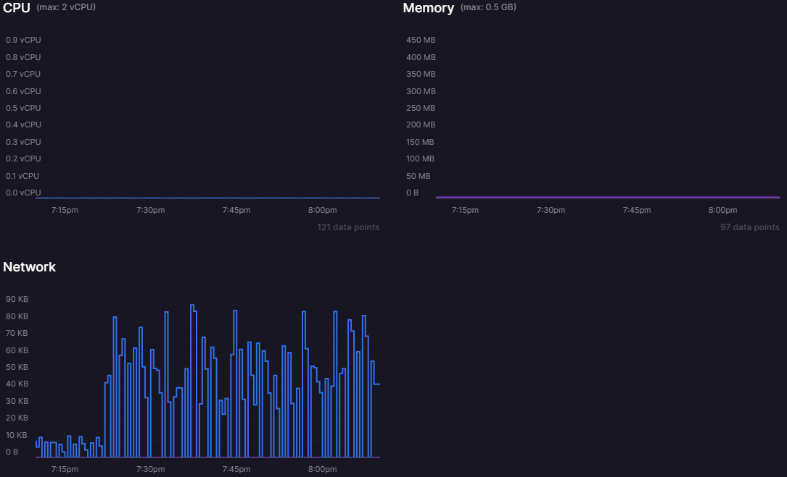
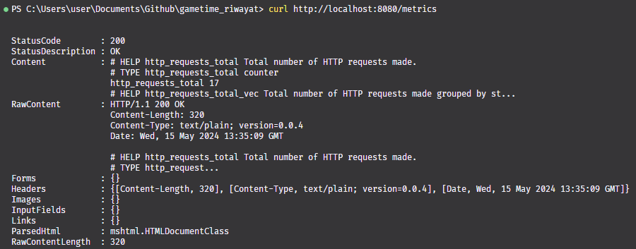
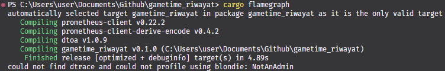

# Riwayat Transaksi
Microservice dari repository **Game Time** yang memiliki peran sebagai pengatur riwayat transaksi antarpengguna aplikasi.

## Monitoring
Untuk bagian monitoring, sebenarnya pada *deployment* Railway sudah disediakan visualisasi untuk memonitor penggunaan CPU, memory, dan network.

Saya juga sudah mencoba untuk melihat metrik menggunakan prometheus di sini.

## Profiling
Kurangnya tutorial menggunakan Rust membuat saya kesulitan dalam menerapkan profiling. Saya sudah mencoba untuk menggunakan package `hyperfine` untuk benchmarking dan `flamegraph` untuk visualisasi juga, namun keduanya tidak dapat dijalankan pada komputer saya sebab saya menggunakan windows. Untuk saat ini saya masih belum menemukan solusinya, namun akan saya perbaiki secepat mungkin.

## Lisensi